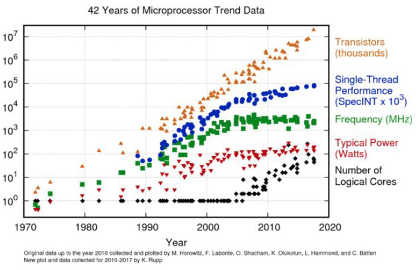
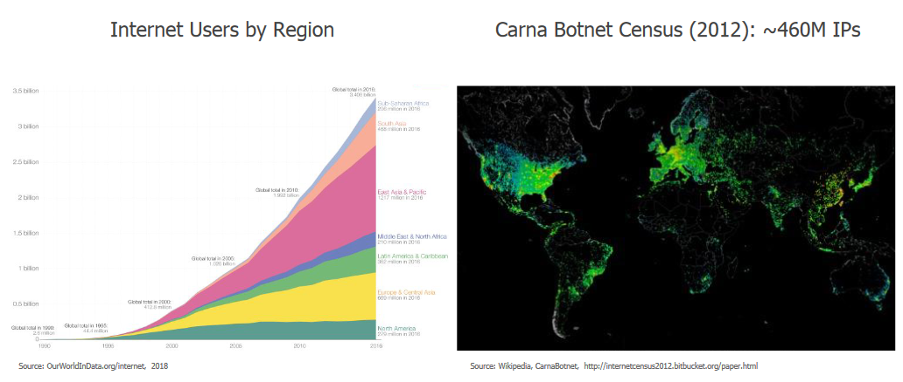
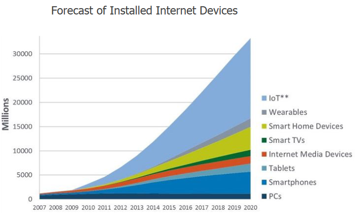
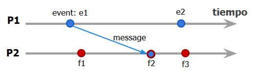
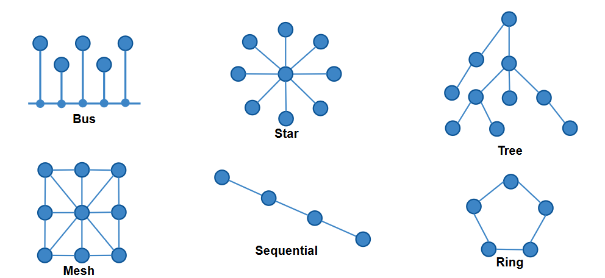

# Introducción

Recordemos los conceptos básicos antes de arrancar con la programación distribuida.

## Conceptos previso

### Concurrencia

Un programa concurrente es aquel que ejecuta distintas tareas de manera simultánea o incluso paralela. Normalmente se suele compartir recursos y se debe competir para obtener acceso a los mismos. Ahí nuestra tarea de sincronizarlos y coordinarlos para minimizar las colisiones y maximizar la eficiencia del uso de los recursos.

### Redes

Una red es un conjunto de computadoras interconectadas entre sí que se comunican entre sí para compartir recursos y servicios.

## Temas principales

## Programación distribuida

Pasamos de trabajar de un único computador a trabajar con varios computadores interconectados. La programación distribuida es un paradigma de programación que se encarga de coordinar y sincronizar los distintos procesos que se ejecutan en los distintos computadores distribuidos en la red que trabajan en conjunto para resolver un problema en conjunto.

### Diferencia entre usar y programar un sistema distribuido

Cuando usamos servicios CLOUD somos usuarios de un sistema distribuido. Nosotros en la materia vamos a ser los encargados de basado en teoría altamente fundamentada y probada, programar un sistema distribuido y hacer transparente su uso para el usuario final.

### Documentación

En sistemas distribuidos ya no es una opción tener una serie de gráficos sencillos como en sistemas centralizados. La documentación debe de alguna forma explicar sistemas con >20 microservicios, >10 bases de datos, >10 servidores, >10 servicios de cache, >10 servicios de mensajería, etc. Esto es imposible de graficar de la manera convencional y se debe recurrir a documentación de otro tipo.

### Paradigmas de programación

Los paradigmas de programación ya están desarrollados y existen muchisimas implementaciones de los mismos. Nosotros vamos a estudiar los fundamentos de los mismos y vamos a ver como se aplican en sistemas distribuidos de manera genérica. Es decir, no debender de bases de datos específicas como MySQL, PostgreSQL, etc. o de servicios de mensajería específicos como RabbitMQ, Kafka, etc. sinó que vamos a estudiarlos de manera genérica.

### Aplicaciones reales

Aplicaciones reales se refiere a implementaciones reales y concretas de los paradigamas de progación. Son soluciones que se usan en empresas para resolver problemas reales, de escala, de alto volumen y de alta disponibilidad. Hay distintos casos de estudio que vamos a ver en la materia.

- **NFS**: Network File System, un sistema de archivos distribuido.
- **GCP**: Google Cloud Platform, un servicio de cloud computing.
- **App Engine**: Un servicio de Google Cloud Platform para hacer deploy de aplicaciones reales
- **Microservicios**: Una arquitectura de sistemas distribuidos muy popular hoy en día.

### Tolerancia a fallos y recuperación

Vamos a estudiar como se pueden diseñar sistemas distribuidos que sean tolerantes a fallos y que puedan recuperarse de los mismos.

## Temas de la clase

### Ley de Moore

La ley de moore predice que la cantidad de transistores en un microprocesador se duplica cada 2 años. Esto hoy en día ya no se cumple, pero la ley de moore sigue siendo un buen indicador de la evolución de la tecnología.

Hay muchos otros parámetros que siguen un crecimiento exponencial, como hoy en día es la cantidad de procesadores lógicos en un microprocesador, la cantidad de memoria RAM, la cantidad de almacenamiento, la cantidad de ancho de banda de las redes, etc.

Por otro lado, parámetros como frecuencia de reloj, latencia de acceso a memoria, latencia de acceso a disco, etc. no siguen un crecimiento exponencial sino que se quedaron más planchados por limitaciones físicas (interferencias electromagnéticas, latencia de la luz, etc.).

Por último se desarollo mucho en efiencia energética mientras que se aumenta la performance lo cual es muy positivo en términos de sustentabilidad, económicos y de performance.

### Tendencias geográficas

### Tendencias de dispositivos

### ¿Qué es un sistema distribuido?

- "Colección de computadoras independientes que el usuario ve como un solo sistema coherente" - Andrew Tanenbaum
- “Es un sistema de computadoras interconectadas por una red que se comunican y coordinan sus acciones intercambiando mensajes” - Coulouris
- "Aquel en el que el fallo de un computador que ni siquiera sabes que
existe, puede dejar tu propio computador inutilizable" - Leslie Lamport

### Areas de aplicación

- Big Data, Analytics y Machine Learning
- Aplicaciones escalables (docker)
- IOT
- Weareables (no prospero)

### Arquitecturas de sistemas distribuidos

- **Cliente-Servidor**: Un cliente se conecta a un servidor para obtener un servicio.
- **Peer-to-Peer**: Todos los nodos son iguales y se conectan entre sí para obtener un servicio.
- **Heterogéneos**: Nodos con distintas capacidades y sistemas operan en conjunto para proporcionar un conjunto de servicios.

### Modelos de análisis

- **Modelos de estado**: Del estilo de maquinas de estados o autómatas finitos.
- **Happen-Before**: Relación de orden entre eventos. Se dice que si un evento A sucede antes que un evento B y si A y B son eventos relacionados, entonces A es un potencial causante de B.

### Topologías

### Centralizado vs Distribuido

Es mejor centralizados cuando:

- No hay conexiones
- Si hay conexiones pero no hay trabajo colaborativo, sin objetivos en común, sistemas de tiempo compartido, terminales de conexión, etc.
- Muy dificiles de escalar (en términos de recursos).

Es mejor distribuido cuando:

- Componentes conectados y realizando trabajo colaborativo o se buscando un objetivo común
- Escalan distribuyendo la carga de trabajo y los recursos (nodos, regiones, canales de comunicación, etc.)

### Ventajas

Ventajas de centralizado:

- **Control**: lógica de control muy simple, efectiva y en ocasiones más eficiente.
- **Homogeneidad**: promueve los estándares tanto en hardware como en software.
- **Consistencia**: es posible definir fuertes políticas de consistencia de información y monitoreo.
- **Seguridad**: menos 'superficie de ataque' frente a amenazas

Ventajas de distribuido:

- **Disponibilidad**: si un nodo falla, el sistema sigue funcionando y puede seguir brindando servicios.
- **Escalabilidad**: mejores opciones para adaptarse a las nuevas escalas o necesidades.
- **Reducción de latencia**: se puede mejorar mucho en términos de latencia gracias a la distribución de los nodos geográficamente.
- **Colaboración**: permite colaboración entre sistemas de forma orgánica y natural.
- **Movilidad**: no están atados a la ubicación física de los nodos.
- **Costo**: en ocasiones puede ser más barato dado que se pueden usar servicios de terceros.

### Centralizado vs Descentralizado vs Distribuido

- **Centralizado**: Concentración de autoridad y control en un solo nodo.
- **Descentralizado**: Transferimos la autoridad a nodos más bajos en la jerarquía.
- **Distribuido**: Implica usar un modelo descentralizado de control de

### Pensamiento distribuido - Ley de Conway

"Cualquier organización que diseñe un sistema, inevitablemente producirá un diseño cuya estructura será una copia de la estructura de comunicación de la organización" - Melvin Conway

Implicaciones: diseñamos sistemas en funcion de las organizaciones que nos rodean, de lo que estamos acostumbrados a ver y de lo que nos resulta más natural.

No es ni bueno ni malo, simplemente es una observación de la realidad.

El hombre tiende a diseñar sistemas distribuidos y eficientes que minimizan los costos, la energía y los recursos necesarios para llevar a cabo una tarea.

### Virtualización

TBC
